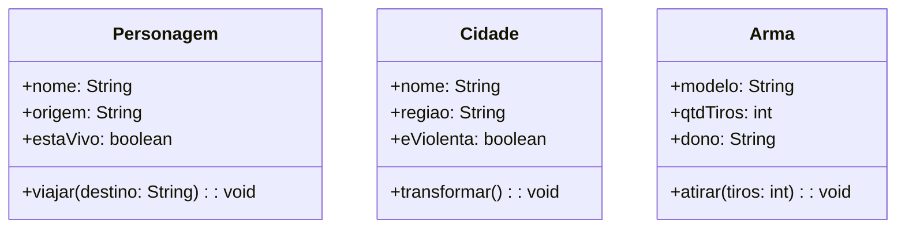
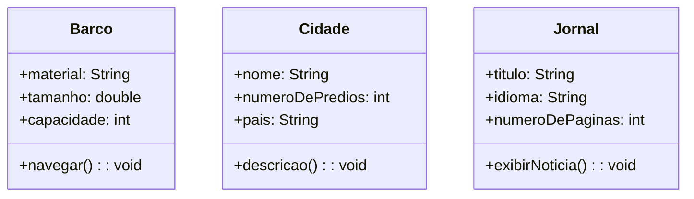
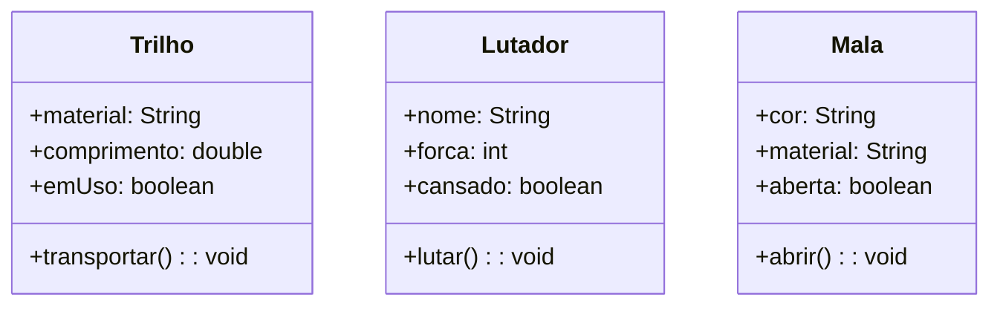
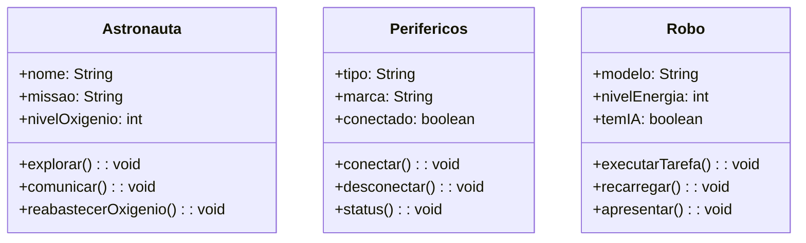
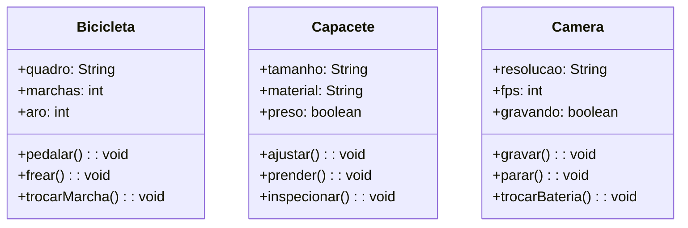

# Projeto LP – Modelagem em Java

Projeto da disciplina de Linguagem de Programação: modelagem a partir de **Música**, **Duas obras de Vik Muniz**, **Imagem Doodle** e **Vídeo**.  

---

## 🧪 Teste de Mesa
O teste de mesa com 10 cenários (entradas e resultados da média) está disponível no arquivo:
[Atividade Linguagem de Programação.xlsx](Atividade%20Linguagem%20de%20Programação.xlsx)

---

## 🎵 Música - Faroeste Caboclo (Legião Urbana)

## 📐 UML

---

## 🖼️ Obra Vik Muniz – *Lampedusa*

## 📐 UML 

---

## 🖼️ Obra Vik Muniz – *Track Brawl*

## 📐 UML

---

## 🎨 Doodle

## 📐 UML

---

## 🎬 Vídeo - Jackson Goldstone Cases Gap - ANDORRA 2025
https://www.youtube.com/shorts/MQbCJ1ldr9A

## 📐 UML

---
